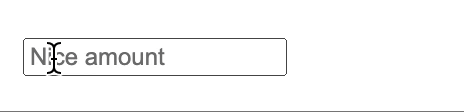

# React AmountInput 👾
> a `<input type="number" />` but that nicely displays amounts



- [x] ⌨️ Always aligned cared
- [x] ␡ Backspace and delete compatible (+ works with selection)
- [x] ⬆️ use up and down arrows (+ works with selection)
- [x] 🌍 supports any decimal and thousands separator

## Dev
Install peer dependencies for Storybook
```sh
npm run test
npm install --no-save react-dom webpack
npm run storybook
```
